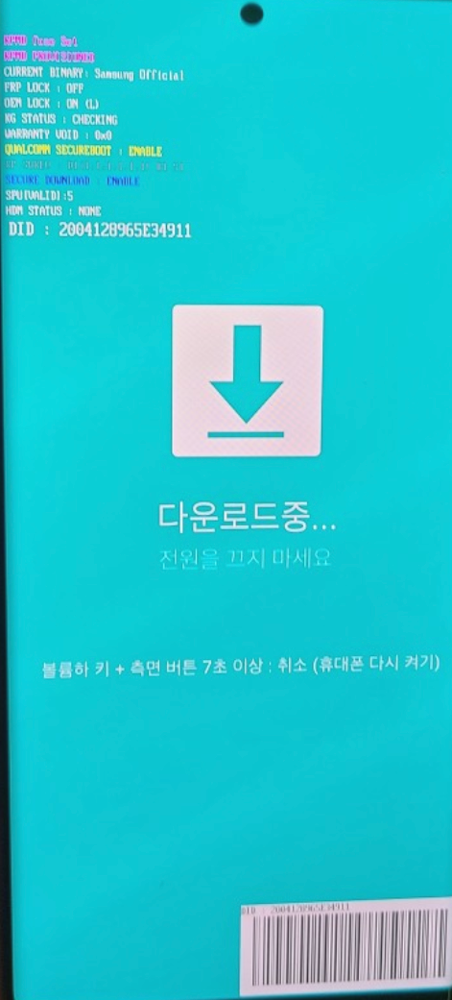

## Samsung Galaxy S25+ 刷机 解锁 Root

拿到新手机后瞎倒腾一番, 过程中发现相关资料有点少 稍微整理一下

#### 国行刷港版系统

s25+ 国行 港版 台版硬件一致 所以可以互相刷机 不用解锁

1. 下载系统固件
   官网没找到 第三方网站也大多是收费的 最后找到这个开源项目
   https://github.com/zacharee/SamloaderKotlin
   使用这个开源项目
   
   
   设备型号 和 序列号 在 `设置 > 关于手机`里可以查到
   地区代码:   **国行 CHC，港版 TGY，台版 BRI**  **美国公开版 XAA** ，美国定制运营商 ATT SPR TMB USC VZW......，  
                      加拿大 XAC  
                      韩国 SKC LUC KOO KTC
   输入后 检查更新 会获取最新固件
   点击下载即可

2. 退出账号 (没验证过是不是必须的)、
     **再次提醒：三星账户，谷歌账户退出 否则有可能会有谷歌锁****

3. 连接手机进入download模式
   关机状态下同时按音量加减  然后不要松开插入数据线 (测试下来先插上线好像不行)
   直到进入下图界面1  然后按音量加继续即可进入刷机模式  如下图界面2 
     

4. Samsung Odin刷机
   -------------
   
   > ps: 这里显示绿色代表电脑和手机已经连接(_如果此时电脑Odin能识别到端口最好，识别不到端口的话就自行安装驱动_)
   > https://developer.samsung.com/android-usb-driver
   
   
   官网: https://odindownload.com/ 

         下载链接: 

          打开后如上图

               第一步下载的固件 解压后类似的五个文件  前四个分别点击上面的 BL AP CP CSC 选择即可(直接拖进应用里好像也可以 没验证)

               文件比较大 可能会卡死 重新来就行了 不影响

               

       **解释：** CSC有两种选择选择CSC会抹除数据恢复出厂设置，选择HOME会保留数据等于只是更新系统。  
       **提醒**：导入AP的时候，由于文件太大会有短时间的卡顿，属于正常情况。

    

    导入完成之后直接点击Start，**途中不要断开数据线，这非常重要！**

    显示PASS后等待手机自动重启开始初次设置即可，。

    

    **提醒：**

1. **如果刷机失败，重新刷机即可！**
2. **首次设置不要连接Wi-Fi，否则无法激活。** (因为要初始化谷歌组件, 有网络条件的可忽略)
   
   
   
   

> 以上主要参考自(或复制自也行😄)
> 
> [三星刷机 线刷 刷公开版/国行和港版互刷 (三星使用手册) - kingwzun - 博客园](https://www.cnblogs.com/kingwz/p/18081314) 

#### 解锁bootloader

> 影响: 
> 
> 会失去保修
> 
> 一些基于硬件的安全功能 支付功能会受影响
> 
> 开机界面会变得很丑
> 
> 具体看网友评测吧 知道自己在干嘛就行

1. 开启开发者模式
   `设置 > 关于手机 > 软件信息 > 编译编号` 连续点击多次  有说5次 有说7词的 反正多点几次 直到提示 开发者模式已启用

2. 开启usb调试和oem解锁
   `设置 > 开发者选项`

3. 关机 然后进入解锁模式
   关机状态下同时按音量加减 然后不要松开插入数据线 (测试下来先插上线好像不行)直到进入下图界面1
   然后如图中提示 长按音量+(一直没反应的话记得松开哈) 后面的按提示就可以了 一路下一步就可以了
   
   
   
   
   
   > [How to unlock bootloader of Samsung Galaxy S25 Ultra](https://www.ytechb.com/unlock-bootloader-of-galaxy-s25-ultra/)
   
   

#### 使用 Magisk 获取三星 Galaxy S25 (Ultra) 的 root 权限

1. 前面下载的固件 解压后 
   现在从 AP 文件中提取 init_boot.img.lz4，从 BL 文件中提取 vbmeta.img.lz4   (随便拿个解压工具打开就好 我用的nanazip)
   然后打包成 一个tar文件  直接压缩 不需要多余的文件夹

2. 使用 magisk patch 这个tar文件 然后把patch之后的文件传回电脑上
   
   

3. 手机进入download模式  参考上面的刷机过程

4. 在PC上打开Odin工具，**将补丁文件加载到AP选项卡中**
   将BL_xxx.tar.md5加载到BL选项卡中，将CP_xxx.tar.md5加载到CP选项卡中，将CSC_xxx.tar.md5加载到CSC选项卡中。

   5. 等待刷机完成即可

       有可能会提醒你清除数据 否则打不开 按提示操作即可

> [How to root Samsung Galaxy S25 (Ultra) with Magisk](https://www.ytechb.com/how-to-root-samsung-galaxy-s25-ultra/)

